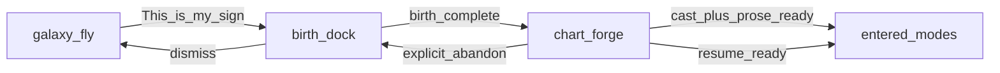

# In-place birth dock and durable chart forge

When a visitor confirms a sign, they stay on the main galaxy stage: the plate and stars move aside, and birth intake docks beside (or under) the sky. After intake is complete, a dedicated full-bleed **forge** scene builds the visitor chart (ephemeris cast + AI-written mode copy) with personal wits on screen. Forge progress is durable and resumable. When ready, they enter the full chart chrome (Sky / Body / Gates / Machine / Readings / Bones / Ask).

## Problem

Today “This is my sign” sets `chat: true` and swaps `GalaxyCopy` for a full `BirthChat` overlay. The WebGL canvas stays mounted and the plate already slides into a clear well (`birthchat-slide`), but the product still **feels like a second screen**: galaxy chrome is replaced, and finishing intake jumps straight into visitor/shelf modes with only seed prose (“Essays are not invented past the table”).

Visitors want:

1. No second screen for birth intake — same sky page, focused dock.
2. A deliberate **making** beat after intake, with intrigue while the chart is built.
3. Cast **and** written mode copy ready before chart modes open.
4. Interruptions (refresh, back, tab close, network) must **never wipe** AI/cast progress.

## Goal

One continuous vault journey on `/`:

```text
galaxy (fly) → dock (birth on sky) → forge (making scene) → entered (modes)
```

| Phase | Sky | Chrome | Panel |
| --- | --- | --- | --- |
| `galaxy` | Fly-through + plate at station | Title, strip, claim | None |
| `dock` | Same canvas; plate slides into clear well | Focused: strip + claim hidden; auth + Back remain | Birth form (today’s BirthChat steps) |
| `forge` | Full-bleed making composition | Minimal cancel / safe abandon | Rotating personal wits while job runs |
| `entered` | Chart stage as today | Sky / Body / Gates / Machine / Readings / Bones / Ask | Detail / Ask as today |

## Non-goals

- Rewriting Ask’s voice or bones-only law for research desks.
- Keeping WebGL fly chrome visible during forge (forge is a dedicated composition).
- Soft-dock / live strip while birth is open (focused dock only).
- Phone keeps today’s full BirthChat overlay (phone uses stacked dock on the same page).
- Inventing ephemeris, degrees, or houses via AI — tables stay calculated; prose is generated **from** tables only.

## Architecture

**Approach:** one continuous vault state machine on `/` (not a `/forging` route). Drive phases in zustand; reuse seek, slide, and busy locks.



### State

Replace bare `chat: boolean` with an explicit phase (migration may keep `chat` as a dock alias briefly):

- `phase: "galaxy" | "dock" | "forge" | "entered"`
- Existing: `pickedSign`, `birth`, `entered`, shelf / visitor payloads
- Forge: `forgeJobId: string | null` (server truth lives in DB)

`openBirthChat(sign)` → `phase: dock`, seek sign, start plate slide.  
Dock completion that today calls `openVisitor` / shelf → start or resume forge job → `phase: forge`.  
Forge `ready` → `openVisitor(enrichedNativity, skyNatal)` → `phase: entered`.

`galaxyTravel.busy` remains true in `dock` and `forge` so auto-walk and fly do not fight the intake.

### Layout — dock

**Desktop (≥ md):** plate + stars settle into the left/center clear well via existing `computeBirthChatSlide`. Birth panel docks right (`max-w-md`), translucent over a soft gradient. Same BirthChat steps (`offer` → date → optional deeper → rest).

**Phone (below md):** plate lifts / slides up; form fills the lower half (scrollable). Same phase; CSS + slide axis only.

**While docked:** strip and “This is my sign” hidden; travel locked; **Back to sky** restores `galaxy`, clears birth draft, slides plate home.

**Implementation sketch:** keep BirthChat form logic; change shell from full overlay takeover to a dock region in `VaultApp` while `GalaxyCopy` chrome is suppressed. Sign name remains the panel header.

### Layout — forge

Full-bleed making composition on the same app shell (cut away from fly chrome). Soft progress (real stages, not fake %). Wit reel: curated + light AI lines keyed to sun sign, date, degree band when cast returns, place, element/modality. Minimum dwell (~4–8s) so wits can play even if the job is fast.

Safe cancel is **explicit abandon** only (see durability). Soft dismiss / refresh must not abandon.

## Durable forge jobs

Forge work must survive interrupt. Progress is **never** held only in React state.

### Job row (DB)

Create a `chart_forge` (name flexible) table. Key by:

- Authenticated `user_id` when signed in, else a durable anonymous session token, **and**
- Birth fingerprint: sign + year/month/day + optional hour/minute/place

Suggested stages on the job:

| Stage | Payload | Done when |
| --- | --- | --- |
| `cast` | `SkyNatal` + tabled `Nativity` JSON | Ephemeris / visitor cast succeeded |
| `prose` | Mode-facing prose chunks on that Nativity | Each mode chunk marked complete |
| `ready` | Final enriched `Nativity` + sky | Cast OK and all prose chunks OK |

Chunk prose by mode (or stable section keys) so a kill mid-generation does not redo finished sections.

### Interrupt rules

- Refresh, Back, tab close, network blip: client may leave; **job keeps running or stays stored**.
- Return with in-flight job → resume forge UI (wits again if still running).
- Return with `ready` job → skip to `entered` (or brief forge flash then enter).
- Retry / re-entry with same fingerprint is **idempotent**: never regenerate a completed chunk; only continue missing stages.
- **Explicit abandon** (“Stop making this chart”) is the only path that marks a job abandoned and allows a fresh start.

### Client

Forge phase holds `forgeJobId`. Poll or reconnect for status. Local wits are cosmetic; server job is source of truth.

### Pipeline

1. **Cast** — existing visitor path (`computeVisitorNatal` / cast → skeleton Nativity). Persist on job before prose.
2. **Written chart** — new server fn (xAI, Ask-adjacent voice: precise, unsentimental; tables only as facts). Fill Sky / Body / Gates / Machine / Readings / Bones seeds. Not live Ask Q&A.
3. Exit gate: cast OK **and** prose OK **and** minimum dwell.

## Errors

| Case | Behavior |
| --- | --- |
| Cast / geocode failure | Message in dock or forge; job not `ready`; cast stage incomplete |
| AI chunk failure | Retry that chunk once; keep cast + completed chunks |
| Serverless timeout / kill | Job stays `running` or `partial`; resume continues missing chunks — **never wipe** |
| Missing `XAI_API_KEY` | Cast + curated wits may finish; prose fails soft → offer “Enter with tables only” or wait; **never delete cast** |
| Explicit abandon | Only path that discards an unfinished job |

Prefer tables-only entry over blocking forever after hard AI failure.

## Testing

- Dock: “This is my sign” keeps canvas mounted; strip/claim hidden; plate slides; Back restores galaxy.
- Phone: stacked layout; scroll form without losing sky.
- Forge: submit creates job; refresh mid-forge resumes same `jobId` / stages.
- Idempotency: second start with same birth fingerprint reuses job; no double AI for done chunks.
- Exit: ready job opens entered modes with enriched Nativity; Ask still uses bones rules for research charts; visitor Ask follows whatever visitor path already allows.
- Abandon: only explicit cancel clears unfinished job; refresh does not.

## Milestones

One design, staged ship:

1. **Dock** — phase machine + BirthChat as side/stacked panel; temporary handoff may still use today’s cast→visitor until forge ships.
2. **Forge shell** — full-bleed making UI + job row + cast persistence + resume.
3. **AI prose** — chunked mode generation into the job; gate `entered` on `ready` (+ min dwell).

## Files likely touched

- `src/lib/store.ts` — phase, forgeJobId, open/close transitions
- `src/components/overlay/VaultApp.tsx` — phase chrome; mount dock vs forge vs GalaxyCopy
- `src/components/overlay/BirthChat.tsx` — dock shell; handoff to forge instead of immediate `openVisitor`
- `src/lib/galaxy/travel.ts` / slide helpers — busy + slide reuse (no math rewrite required for dock)
- New: forge UI component, forge job server module, migration for `chart_forge`
- `src/lib/chart/visitor-nativity.ts` / sky cast — feed cast into job
- Ask-adjacent xAI helper for prose chunks (new), distinct from `askTheChart` research gate

## Success criteria

- Confirming a sign never feels like navigating to a separate birth page.
- Completing intake always shows the making scene before modes (once milestone 2+ ships).
- Modes open with calculated tables and generated mode prose when AI succeeds.
- Killing the tab mid-forge and returning resumes without regenerating completed work.
